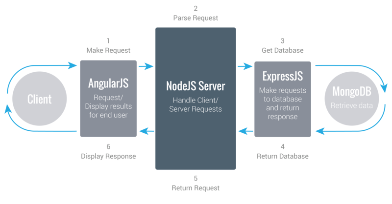

# 第2部 Node.jsをWindowsで動かす

---

第3部は準備に時間がかかるため、先に準備だけしてしまいましょう

[先に準備する](CHAPTER_3-1.md)

---

## Node.jsとは

* ノンブロッキングI/Oとイベントループ方式で少ないメモリでも大量のアクセスを処理することができる
* サーバ側の処理をJavaScriptで記述できるというメリットがあります

---

## Node.jsをとりまくミドルウェア

Node.jsと組み合わせた次の4つのミドルウェアの構成のことをMEANスタックと呼びます

* Mongo DB
* Express　
* Angular JS
* Node.js



ちなみに以前はLAMPスタックといって、以下の構成が注目されていました

* Linux
* Apache(Web サーバー)
* MySQL
* Perl or Python or PHP

---

## Node.jsをWindowsで動かす

* WindowsにNode.jsをインストールします
	* node-v8.11.2-x64.msi

* プロジェクトのディレクトリを作成します
	* C:\Users\\{ユーザ名}\nodework\talkapp

* コマンドプロンプトを開く
	* スタートにcmdと入力する

* プロジェクトのディレクトリに移動します
```CMD
$ cd C:\Users\{ユーザ名}\nodework
```

* Node.jsでプロジェクトを作成する
```CMD
$ npm init
```

* ダイアログに回答します
	* package name: talkapp
	* entry point: app.js
	* package.jsonが生成されます

* app.jsというファイルを作成して以下を記述する
```node
console.log('Hello!');
```

* 起動します
```CMD
$ node app.js
```

---

## Expressでサーバーを起動する

* Expressをインストール。
	* --saveを付けるとpackage.jsonの依存関係リストに追記されます

```CMD
$ npm install express --save
```

* 以下をapp.jsに記述します

```node	
/* expressモジュールをロードし、インスタンス化してappに代入。*/
var express = require("express");
var app = express();

// ポート番号3000番で待ち受ける
var server = app.listen(3000, function(){
    console.log("Node.js is listening to PORT:" + server.address().port);
});
```

* 起動します

```CMD
$ node app.js
```

* `Node.js is listening to PORT:3000` と表示されればOKです

---

## Node.jsでクライアントサイドのファイルを提供する

第1部で作成したHTML,CSS,JavaScriptをExpressを使ってそのまま提供してみましょう

* コマンドプロンプトで CTRL + C を入力してnodeを停止します
* public フォルダを作成して第一部で作成したHTMLとJSとCSSを配置します
* 以下をapp.jsに記述します
	
```node
// publicフォルダ内の静的ファイルのHTTPアクセスを許可する
app.use('/', express.static('public'));
```

* 起動します

```CMD
$ node app.js
```

* ブラウザで [http://localhost:3000/index.html](http://localhost:3000/index.html) にアクセスします

---

[次のページ](CHAPTER_2-2.md)
